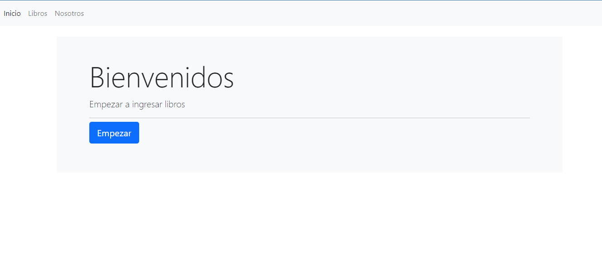
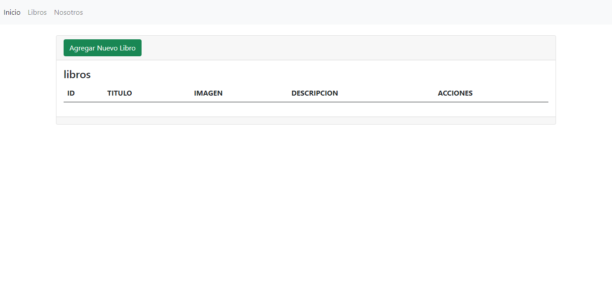
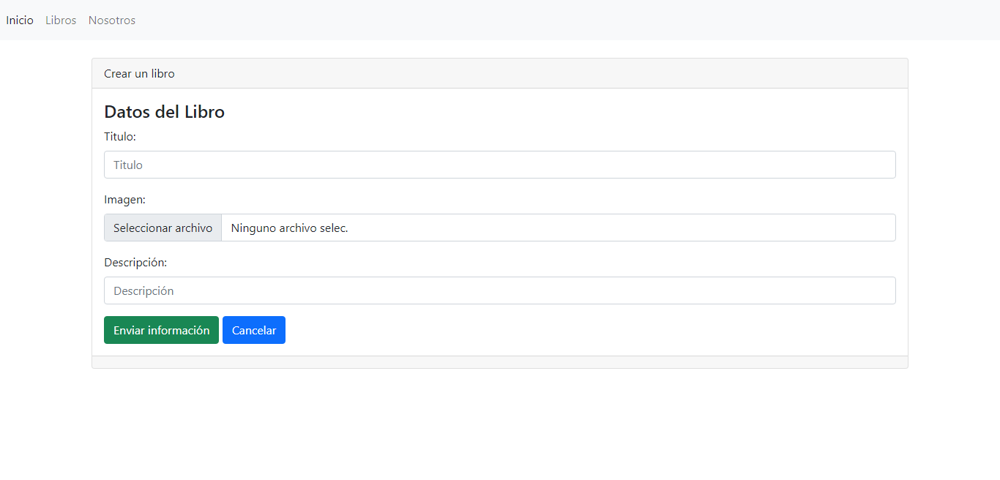
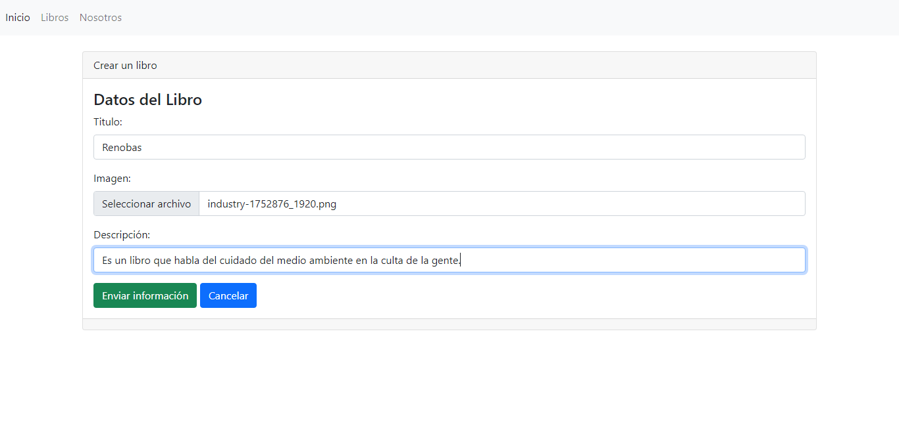
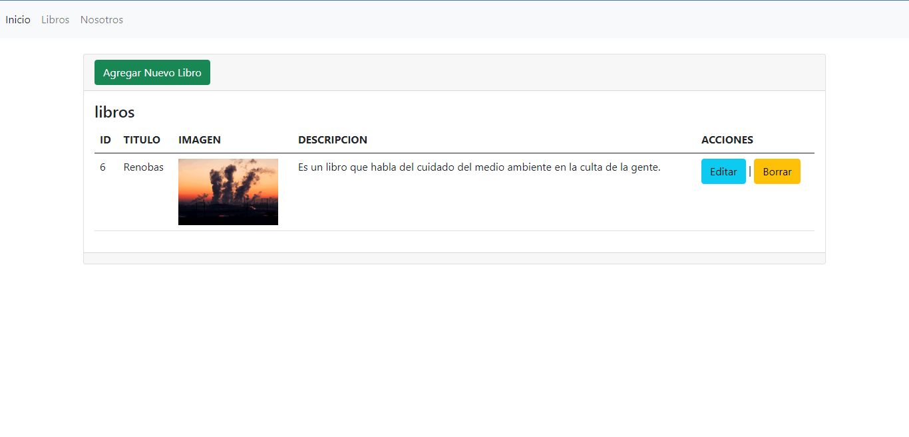
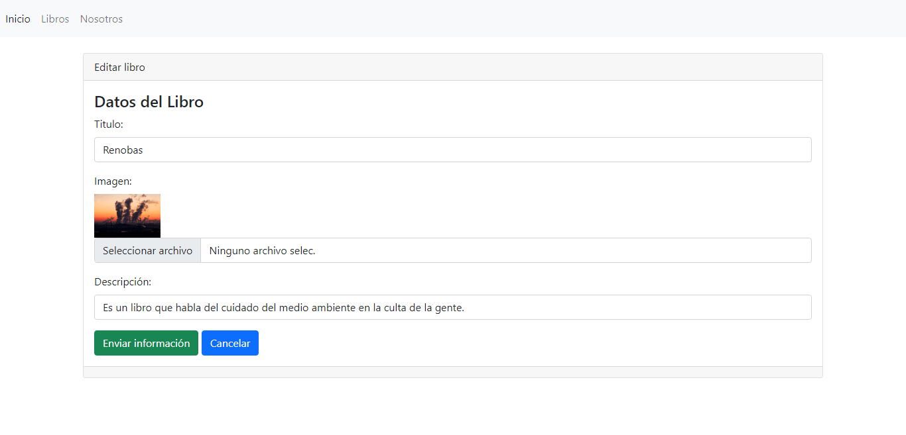
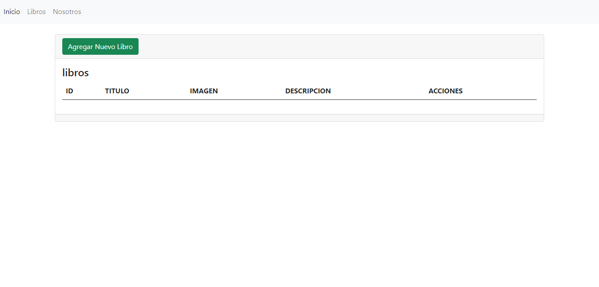

# Libreria

Es un pequeño deserrollo que trata de un sistema que registra libros, edita los datos y los borra.











### Ejecución

```
Encender BASE DE DATOS

Ejecutar --> Python manage.py
```

## Estructura

- Imagenes, Se guardan todas las imagenes que se registran
- Templates, Todas vistas HTML


## Proceso

1. [x] Crea
1. [x] Lee
1. [x] Actualiza
1. [ ] Elimina


